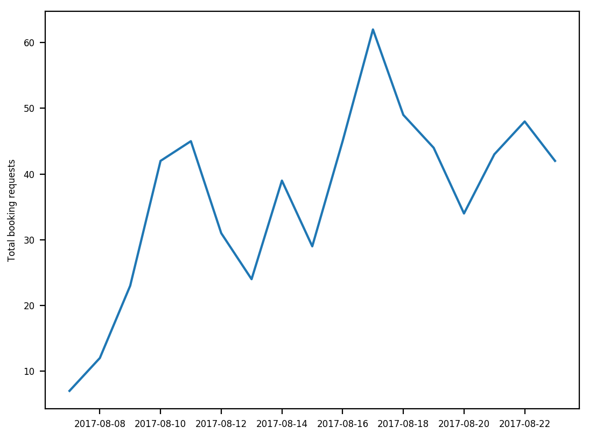
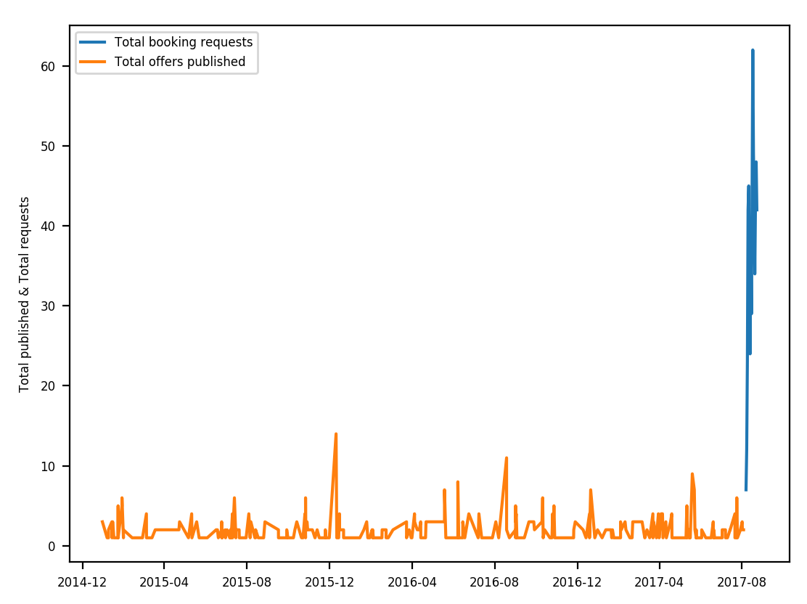
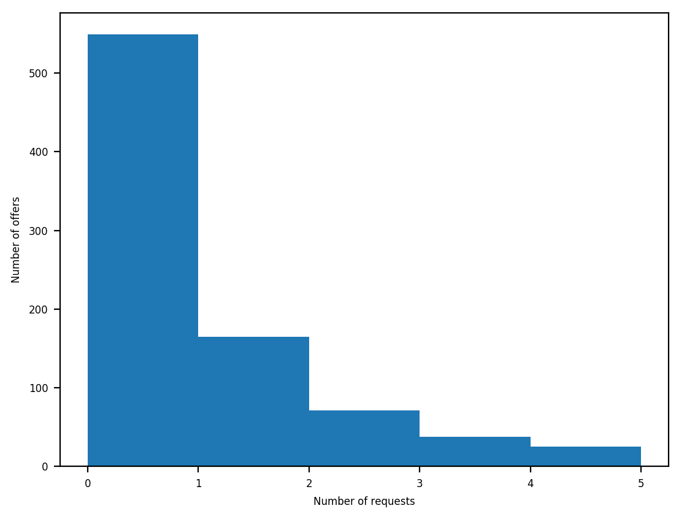
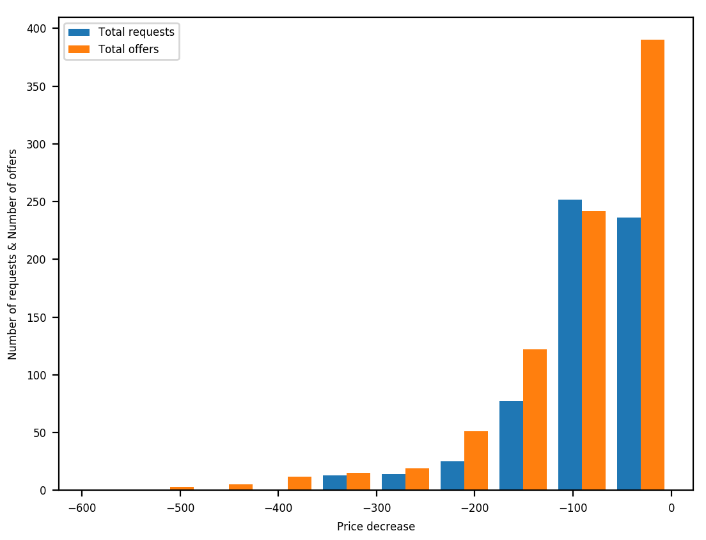
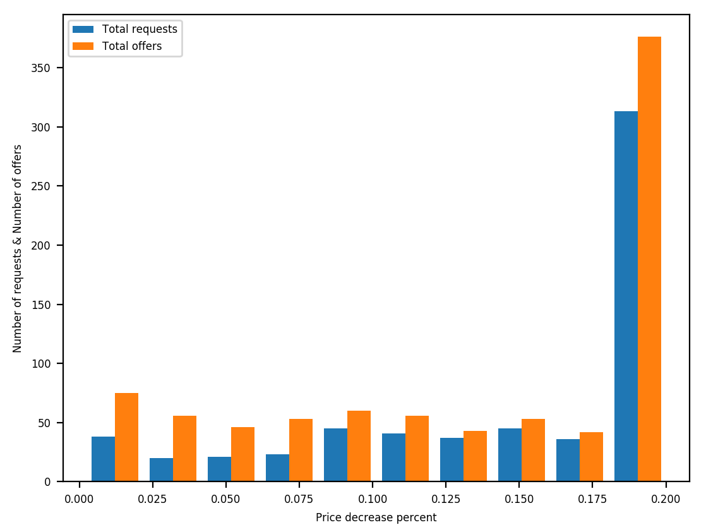
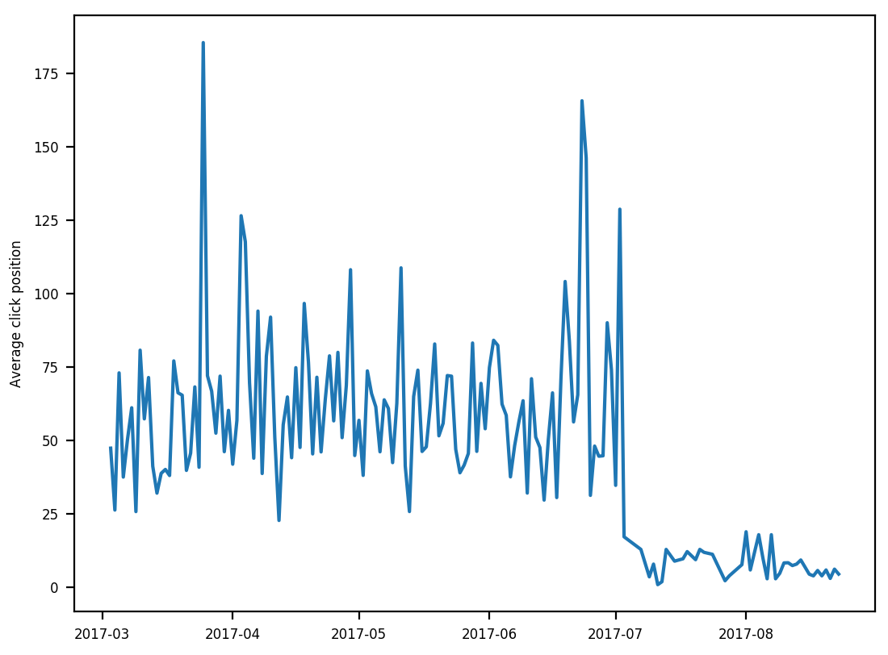
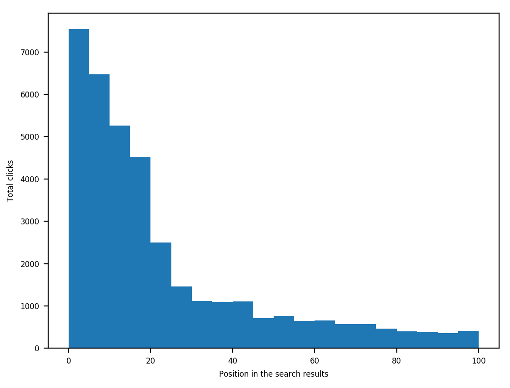
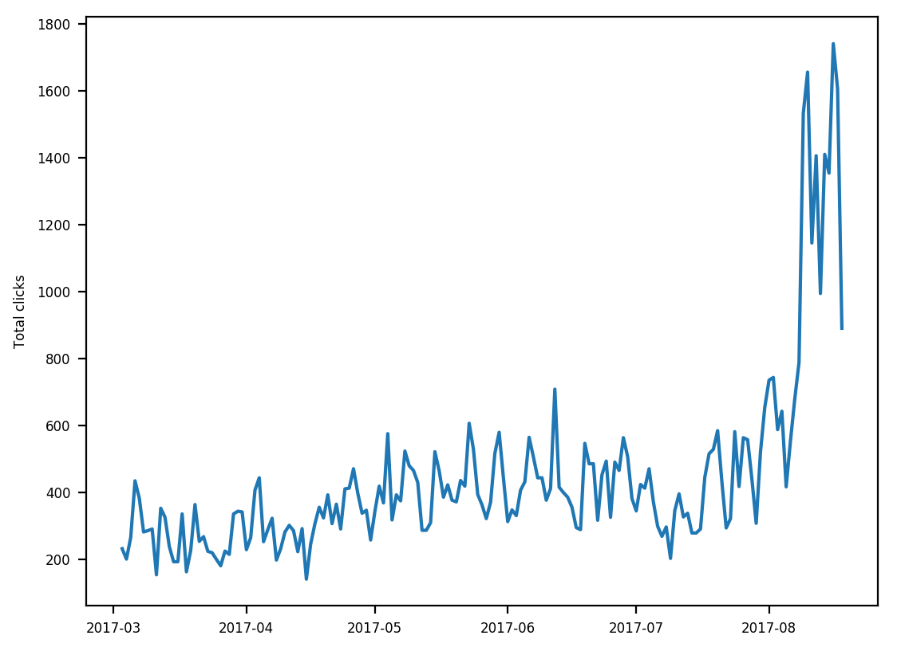

# Product Analyst - Take home test

The goal of the PA team is to understand user behavior and use data to uncover product opportunities.

**There is not required format for this test, but you should not spend more than 3 hours on it.**

## 1 About the challenge

The folder structure is as follows:

```
.
├── Dockerfile
├── LICENSE
├── README.md
├── config
├── notebooks
│   └── data_analyst_take_home_test.ipynb
└── run-jupyter-notebook.sh
```

This is a common project structure and it's the one we use at Uniplaces.

Ideally, your answer will be a notebook in the `/notebooks` folder, containing both your code and analysis.

**Nonetheless, any format will do, just make sure you include all the code (SQL, etc.) and analysis (Excel, etc.)**.

### 1.1 Set up for iPython

Start by cloning the repo:

```bash
> git clone https://github.com/uniplaces/data-analyst-take-home-test.git
> cd data-analyst-take-home-test
```

Make sure you have Docker installed and simply run:

```bash
> sudo run-jupyter-notebook.sh
```

Copy the link that appears in your terminal window, paste it in your web browser and you're good to go.

All the most common data science packages are there, immediately available to use.

### 1.2 Credentials

If you're using iPython, put the credentials in a `config/.env` file as exemplified in `config/.env.dist`.

To use the credentials use `%load_ext dotenv` and `%dotenv` from the iPython notebook, alongside the imports:

```python
import os
import pandas as pd
import numpy as np
import sqlalchemy
import matplotlib.pyplot as plt

%matplotlib notebook

%load_ext dotenv
%dotenv
```

Then, simply use them in your code as environment variables (example below):

```python
conn = 'mysql+pymysql'
user = os.environ.get("DATABASE_USER")
pw   = os.environ.get("DATABASE_PASSWORD")
host = os.environ.get("DATABASE_HOST")
db   = os.environ.get("DATABASE_DATABASE")
port = os.environ.get("DATABASE_PORT")

url  = '{}://{}:{}@{}:{}/{}'.format(conn, user, pw, host, port, db)
eng  = sqlalchemy.create_engine(url, echo=False)

df   = pd.read_sql(sql, eng)
```

You will receive all the credentials via email.

## 2 Take home test

### 2.1 Suggest dates

#### Exercise

Recently, a new feature was deployed, that allows the landlord to suggest new dates for a request.

The way it works:

* The student does a booking request in a given offer
* The landlord receives the booking request and can accept or reject
* As part of the acceptance, the landlord can suggest new dates
* The student can either pay or not the booking.

To evaluate the feature, address the following questions:

1. Is it a useful feature for our landlords?
2. Is there any pattern in the suggested dates? Could this be used to improve the feature, or create new ones?
3. Does it influence the acceptance rate of our landlords, i.e. the percentage of bookings accepted?
4. Does it influence the payment rate of our students, i.e. the percentage of bookings paid?
5. What more data would you require to evaluate the feature and why?

#### About data

Connect to the MySQL database with the credentials provided to you via email.

Use the `tht_suggest_dates_sample` table.

You will have access to the following fields:

* Booking id,
* Booking current state,
* Student request date (requested_at),
* Landlord acceptance date (accepted_at),
* Landlord rejection date (rejected_at),
* Landlord booking expiration date (expired_at),
* Landlord confirmation date (confirmed_at),
* Booking withdrawn data (withdrawn_at),
* New move in date suggested by the landlord (new_move_in_at),
* Date of creation of the new move-in date (new_move_in_created_at),
* New move out date suggested by the landlord (new_move_out_at),
* Date of creation of the new move-out date (new_move_out_created_at),
* Student payment date (paid_at),
* Booking discarded date (discarded_at).

### 2.2 Price recommendations

A few weeks ago (9th of August, to be precise) we initiated a test.

The test consists in the following:

* We would provide price recommendation for overpriced offers without booking requests and available soon
* We would do so by changing the price of these offers, replacing it with our recommended price
* The recommended price is generated by an algorithm developed internally by the data science team
* Landlords would accept or reject the booking request with the new price.

Please address the following questions, analyzing the data below:

1. What are your main conclusions regarding the results of the feature?
2. What other data would you need to evaluate the feature?
3. Can you design an experiment leading to more conclusive results? If so, please describe it.

#### Total booking requests per day on offers with price recommendation





#### Number of bookings per offer with price recommendation



#### Requests and offers by total price decrease





#### Average click position on search for offers with price recommendation



#### Total clicks by search position on offers with price recommendation



#### Total clicks per day on offers with price recommendation


